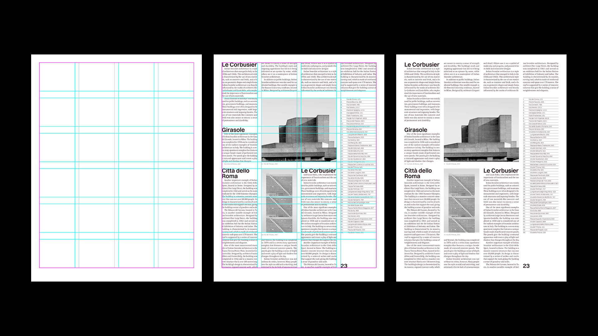

# SmartGrids

SmartGrids is an application that allows you to easily configure and preview modular typography grids.
You can input parameters like the page size, margins, font size, and leading and SmartGrids will show you all the possible grid configurations.

Unlike the built-in grid creation tools in Adobe InDesign, SmartGrids will automatically align the grid to your body copy. The gridlines can be aligned with the cap-height, ascender, or x-height of the text. It also allows for a baseline shift so that the gridlines don't align with the baseline of the text but with the descenders.


Creating cap-height aligned grids in Adobe InDesign is not impossible, but involves a lot of trial and error and manual measuring. This applications allow you to skip the tedious guesswork and manual calculations. SmartGrids will show you all possible grid configurations and output all relevant values which you can then input into your layout software.

The grids follow the style proposed by Josef Müller-Brockamann in his influential 1981 book [Grid Systems in Graphic Design](https://www.niggli.ch/produkt/grid-systems-in-graphic-design/). Typographic grids help you structure your layouts in a meaningful and clean way. When working on larger editorial projects they can speed up your workflow significantly.



### Important note:
Because of its type-first approach the application might enlarge the **bottom margin** to fit a whole number of lines into the text area. (After all we can't work with half a line of text, can we?) This means, that you have to input the **corrected bottom margin** suggested by the application into your layout software. This change will never be greater than the **line height**.

## Installation
### Note:
When running __SmartGrids__ for the first time, it might take a couple of minutes to build its font index. After that it will launch much more quickly.
### MacOS:
**Just install it:**
The easiest way is to download the latest release, which will download a .dmg file which you install just like every other app on your machine.

**Download the source code:**
If you prefer the nerdy way, you can clone the repository or download the source code and run the ```main.py``` file with python.
This requires you to have python3 and the required packages installed. (See [Required packages](#Required-packages))

### Windows:
On Windows, you need to download the source code or clone the repository and run the ```main.py``` file via python. This also requires you to install some packages. (See [Required packages](#Required-packages))
*Note:* SmartGrids is primarily developed for MacOS. Therefore not all features might be available on windows at this point and it might be very buggy.

### Build SmartGrids from source:
SmartGrids is compiled with the **pyinstaller** library. To compile it from source, install the required packages (see [Required packages](#Required-packages)) and pyinstaller with ```$ pip install pyinstaller```.
Then run ```build.py``` with python. An app-file will be created inside the newly created **dist** folder.

## How to use SmartGrids
When setting up a grid with SmartGrids it is helpful to know your Page dimensions, including the preferred margins as well as the font of choice, its size, and its leading beforehand. It is suggested to create the document in InDesign and test out these values beforehand.
1. Select a preset or input all the page and margin values into SmartGrids and select the font.
2. Chose your vertical alignments. The vertical alignment specifies which part of the text the gridlines will align to. When _Cap-Height_ is selected the guides will align with the Cap-Height of the font and so on.
3. Chose the amount of lines between the cells. (The default is 1.)
4. In the Output panel under **Possible Divisions**, it will hopefully show you multiple numbers. These are all possible ways you can divide the text area vertically. (2 will give you 2 rows, 3 will 3, etc.) You can preview them by inputting them under **Amount of Rows**. If it says _None_, there is no possible way to divide the text area into even rows. But fear not! The most efficient way to find a possible configuration is to decrease the bottom margin or change the leading. Adjust these values until you’ve found an amount of rows that you are happy with.
5. Preview your configuration by inputting the desired amount of rows into **Amount of Rows**.
6. **Optional!** Configure and preview the columns. (By default the **column gutter** is equal to the **row gutter**.)
7. Input the values into InDesign. Set up the baseline grid under ```InDesign - Preferences - Grids``` (Don't forget the grid start.) and create guides under ```Layout - Create Guides``` in InDesign according to the output values. Check **Align to baseline grid** in your paragraph setting. **Important:** SmartGrids will likely increase the bottom margin a bit to fit a whole number of lines so you must adjust your bottom margin in InDesign to the value SmartGrid gives you.

<a id="Required-packages"></a>
## Required packages
To install the required packages, navigate into the smart-grids directory and execute the following command in the terminal:

```bash
$ cd [path to directory]
```

```bash
$ pip install -r requirements.txt
```

This will install all libraries that you need to run SmartGrids. If you want to build the app yourself you need to also install PyInstaller:

```bash
$ pip install pyinstaller
```

# About
### Support
SmartGrids is entirely free of charge for both commercial and private use! But code doesn't write itself — so please consider sharing this project with a fellow design aficionado, or even support the project by sponsoring it here on GitHub if you got some use out of it!

Thank you, and happy designing! 🥳

### Copyright
Copyright (c) 2023, Carl J. Kurtz. (See [LICENSE](LICENSE) for more information)
