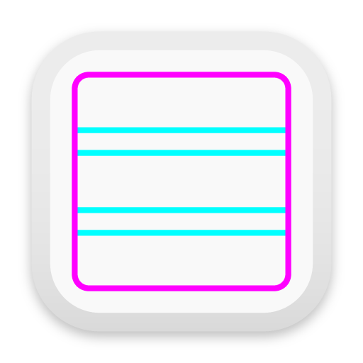

Smart Grids
===========
Smart grids is an application that returns possible configurations for typography grids based on various inputs.
It enables its user to quickly find possible amounts of vertical boxes for a typographical grid which result in a whole number of lines.

The resulting grids follow the style proposed by Josef Müller-Brockamann in his book [Grid Systems in Graphic Design](https://books.google.de/books/about/Grid_Systems_in_Graphic_Design_a_Visual.html?id=YOgtwAEACAAJ&redir_esc=y). The gridlines will align with the cap-height of the font and the space between to vertical grid units is one line. Unlike in Josef Müller-Brockamanns grids the text aligns with the raster at the baseline and not at the descender as proposed by him. This is both easier to implement with contemporary layout programs as well as it gives a cleaner paragraph ending where both the text and an image end.